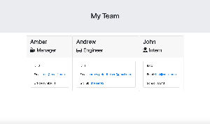

# 10-Template-Engine

## Live site:

Read Me:
https://theisen92.github.io/10-Template-Engine/

The team page:
https://theisen92.github.io/10-Template-Engine/team.html

## Usage

Open Develop and run "npm install" in terminal

Then run "node app.js" to begin the promts

This site can be used for compiling information about employees for creating a team

## Credits

I primarily used the information from class activities and MDN Developer for resources. Bootstrap and Font Awesome for style and design. Node.js and inquirer npm for site functionality. Then jest npm for testing.

## Contributing

I worked on the project alone.

## Challenges

The main challenge that I was running into during this project was understanding the initial file and then how to retrieve and using the information from the prompts

## Live Demo

